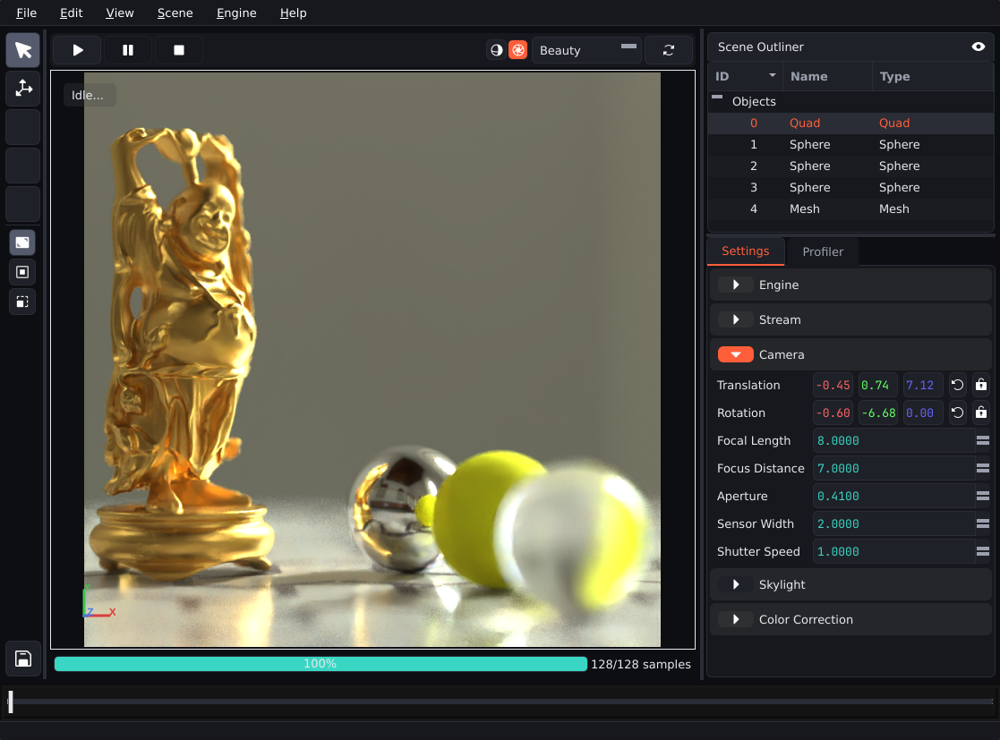
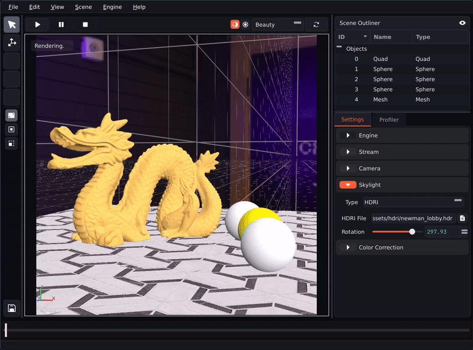

<div align="center">
<h1>NectarRender</h1>

<p>
    <a href="https://github.com/ZacharyBork/NectarRender/releases/latest">
    </a>
    <a href="https://opensource.org/licenses/Apache-2.0">
    </a>
    <a href="https://www.python.org/downloads/">
    </a>
    <a href="https://developer.nvidia.com/cuda/toolkit">
    </a>
    <a href="https://doc.qt.io/qtforpython-6/index.html">
    </a>
</p>

<h4>A physically-based CUDA path-tracing engine with a live, editable scene viewport. Built in C++/CUDA, with a PySide6 desktop GUI wired through pybind11.</h4>
</div>

<p align="center">

</p>

## Description

NectarRender is not a toy path-tracer. It is a complete render engine with two fully interactive back ends (raster-style preview renderer + a full Monte Carlo path tracer), real BVH and SAH construction, live scene editing (object selection, transformation, and runtime object addition), and AI denoising via Intel Open Image Denoise, all running through a threaded engine architecture with a comprehensive inbuilt state machine.

## Features

### Rendering

- Physically-based Monte Carlo path tracing engine with multiple importance sampling.
- PBR metal-roughness material model, with additional support for true Lambertian, Dielectric, Emissive, and Isotropic (volumetric) materials.
- HDRI environment lighting with bilinear-filtered equirectangular sampling.
- Physically-based camera model.
- ACES / Reinhard / Reinhard-Extended tonemapping, Kelvin-based white balance, and full color grading toolset, all implemented as dedicated CUDA kernels.
- Fully-configurable AI denoising via [Intel Open Image Denoise (OIDN)](https://www.openimagedenoise.org/), CUDA-accelerated, and integrated with live stream synchronization against the render pipeline.

### Interactive Viewport

- Scene outliner, camera / skylight / color-correction settings panels, all backed by a full engine state machine.
- Runtime scene editing. Objects can be added to live scenes without a full reload.
- Includes a separate, lightweight raster-style preview mode for real-time scene navigation. Render modes can be switched live from the UI without the need to restart the engine.

<p align="center">

</p>

- Live object selection with screen space outline overlay, backed by a persistent object ID system which survives BVH rebuilds.
- Screen-space projected 3d transformation gizmo for live object manipulation.

<p align="center">

</p>

### Engine Architecture

- Custom templated BVH with binned Surface Area Heuristic (SAH) construction and near-first traversal ordering.
- High-performance tagged-union dispatch pattern for all major components, avoiding the need for virtual dispatch in CUDA.
- Persistent worker-thread engine loop coordinating engine state with Qt GUI thread via GIL-safe callbacks and mutex-guarded shared buffers.
- Highly configurable AOV system.

### Python API

- A full pybind11-based Python API allows for interacting with all major engine components in the host layer without the need to ever interact with the C++/CUDA backend directly.
- Full stub generation for Python-side linting of native C++ components.
- Clean, human-readable, Python-based scene description language:
```python
from nectar_render.python import (
    Scene, Skylight, Hittable, Material, Texture, Vector3, Color
)

my_scene = Scene(
    skylight  = Skylight.hdri('/path/to/hdri/file'),
    lights    = [],
    hittables = [
        Hittable.QUAD(
            position = Vector3(0.0, 0.0, 0.0),
            rotation = Vector3(0.0, 0.0, 0.0),
            scale    = Vector3(5.0),
            material = Material.PBR(
                albedo    = Texture.from_image('/path/to/image/texture', scale=1.0), 
                roughness = 0.15, 
                metallic  = 0.5
            )
        ),
        Hittable.SPHERE(
            position = Vector3(0.8, 0.2, 1.1),
            radius   = 0.2, 
            material = Material.DIELECTRIC(Color.white(), 1.5)
        ),
        Hittable.MESH(
            '/path/to/obj/file',
            position = Vector3(-0.6, 0.0, 0.1),
            rotation = Vector3(0.0, 40.0, 0.0),
            scale    = Vector3(1.0, 1.0, 1.0),
            material = Material.PBR(
                albedo    = Color(1.0, 0.6, 0.15),
                roughness = 0.4,
                metallic  = 1.0 
            )
        )
    ]
)
```

## Tech Stack

| Type             | Technology                                                                     |
| ---------------- | ------------------------------------------------------------------------------ |
| **Core Engine**  | C++17, CUDA                                                                    |
| **Bindings**     | [pybind11](https://github.com/pybind/pybind11)                                 |
| **GUI**          | Python, [PySide6 (Qt)](https://doc.qt.io/qtforpython-6/index.html)             |
| **Denoising**    | [Intel Open Image Denoise](https://www.openimagedenoise.org/)                  |
| **Mesh Loading** | [tinyobjloader](https://github.com/tinyobjloader/tinyobjloader)                |
| **Image I/O**    | [stb_image](https://github.com/nothings/stb)                                   |
| **Build System** | CMake + [scikit-build-core](https://github.com/scikit-build/scikit-build-core) |

## Building from Source

NectarRender currently targets **Linux with an NVIDIA GPU**. Windows / macOS are not currently supported.

### Prerequisites

- CMake ≥ 3.18
- Python ≥ 3.11, with [pybind11](https://github.com/pybind/pybind11) and [scikit-build-core](https://github.com/scikit-build/scikit-build-core) installed
- NVIDIA CUDA Toolkit ≥ 12.8, with matching driver installed
- [Intel Open Image Denoise](https://www.openimagedenoise.org/downloads.html) 2.x, built or downloaded with CUDA device support enabled (`OIDN_DEVICE_CUDA=ON`)

> [!NOTE]
> It is recommended to install NectarRender in a fresh Python environment.

### Build

```bash
# Clone the repository
git clone https://github.com/ZacharyBork/NectarRender.git

# Change directory to repository root
cd NectarRender

# Point CMake to your OIDN install
export OIDN_DIR=/path/to/your/oidn/install

# Install via pip (scikit-build-core)
pip install -e .
```

### Once Built
```bash
python -m nectar_render.gui
```
### Building pybind11 Stubs
**Pre-generated stubs are included by default.** Rebuilding is only required when changes are made to the C++ source code which alter bound components.

```bash
make -C build stubgen
```

## Known Limitations

NectarRender is an actively-developed personal project. It is not currently production-ready software. Current limitations include:

- Linux + NVIDIA only. No cross-platform support is currently offered.
- No pre-compiled binaries. These will be included in a future release. Currently however, the project must be built from source.
- Scene serialization / save-load is not yet implemented. This is high-priority, though, and will be included in a future release.
- There is currently no automated test coverage. This is also high-priority, a comprehensive Pytest-based test suite will be included in a future release.
- Some features are not yet fully implemented, or fully wired up. Some UI elements are currently placeholders with no actual functionality yet.
- You may experience occasional crashes and/or general instability when using this software.
- Documentation is currently very limited. This will be improved as development continues, with the eventual end goal of comprehensive end-user and developer documentation.

## License

NectarRender is licensed under the Apache 2.0 license. A full copy of the license text can be acquired [here](https://www.apache.org/licenses/LICENSE-2.0).

Third-party components are used under their own licenses (see [THIRD_PARTY_LICENSES.md](THIRD_PARTY_LICENSES.md) for details).

## Acknowledgements

The core architecture of this path-tracing engine is based loosely on the fantastic [Ray Tracing in One Weekend](https://raytracing.github.io/) book series by Peter Shirley, Trevor D. Black, and Steve Hollasch. A huge thank you goes out to them for making such an invaluable resource available free of charge.

